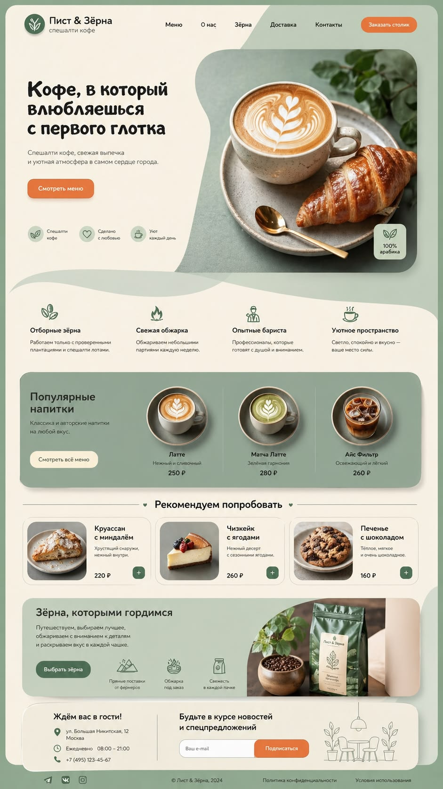

# ☕ [Morning in a Cup] — Landing Page

[](https://your-username.github.io/rsschool-landing-page/)
[](https://your-username.github.io/rsschool-landing-page/)
[](https://your-username.github.io/rsschool-landing-page/)
[](https://your-username.github.io/rsschool-landing-page/)
[](https://rs.school/courses/fullstack-engineering)

## Live demo

- **Landing page:** [https://theFoxTale.github.io/rsschool-landing-page/](https://theFoxTale.github.io/rsschool-landing-page/)

## Screenshot

Idea:


## About

A responsive two‑page landing page for a fictional coffee shop, built as part of the **RS School Fullstack Engineering** course.  
The project features a warm coffee‑inspired palette, smooth interactions, and a fully custom implementation — no frameworks, only semantic HTML, CSS, and vanilla JavaScript.

## Features

- **Two linked pages** — Home and Menu/Catalog
- **Semantic HTML5 landmarks** (`header`, `main`, `footer`, `nav`, `section`, `article`)
- **Light & dark theme** with `localStorage` persistence
- **Burger menu** for mobile navigation
- **Swiper/carousel** for featured drinks or promotions (implemented from scratch)
- **Category filtering** and dynamic card display in the catalog
- **Modal window** with product details and live option updates
- **Fully responsive** layout from 1440px down to 380px
- **CSS custom properties** for a centralized color & typography system
- **Self‑hosted fonts** — no external CDN
- **WebP images** with `loading="lazy"`
- **Smooth scrolling** and back‑to‑top control

## Tech stack

| Area | Tools |
|------|--------|
| Markup | HTML5 |
| Styles | CSS3 (Flexbox, Grid, custom properties, transitions) |
| Interactivity | Vanilla JavaScript (ES6+) |
| Fonts | [Local .woff2 files] |
| Assets | SVG icons, WebP images |
| Deploy | GitHub Pages |

## Project structure

```text
rsschool-landing-page/
├── .github/workflows/      # CI: deploy to GitHub Pages
├── index.html              # Home page
├── catalog.html            # Menu / Catalog page
├── css/
│   ├── style.css           # Main styles
│   └── ...
├── js/
│   ├── main.js             # Theme toggle, burger menu, smooth scroll
│   ├── slider.js           # Custom carousel
│   ├── catalog.js          # Category filtering & card rendering
│   └── modal.js            # Modal window & option logic
├── assets/
│   ├── fonts/              # Local woff2 font files
│   ├── icons/              # SVG icons
│   └── images/             # WebP project images
├── README.md
├── README-part-1.md        # Part 1 description (markup & themes)
├── README-part-2.md        # Part 2 description (interactivity)
└── .gitignore
```

## Getting started

```bash
git clone https://github.com/theFoxTale/rsschool-landing-page.git
cd rsschool-landing-page
```

Open `index.html` in a browser, or serve locally:

```bash
npx serve .
```

Then visit the URL printed in the terminal (usually `http://localhost:3000`).

## Deployment (GitHub Actions → Pages)

Every push to the deployment branch triggers `.github/workflows/deploy-pages.yml`, which publishes the site to GitHub Pages.

### One‑time repository setup

1. Open **Settings → Pages**
2. Under **Build and deployment → Source**, choose **GitHub Actions**
3. Merge the workflow into your main branch, or run it once via **Actions → Deploy to GitHub Pages → Run workflow**

After that, the live site updates automatically on each merge.

## RS School task

This repository follows the **Landing Page** assignment from the RS School Fullstack Engineering course.

- **Repository name:** `rsschool-landing-page` (personal public repo)
- **Branch workflow:**  
  `landing-page` → Part 1 (markup & themes)  
  `landing-page-part-2` → Part 2 (interactivity)
- **Deployed via:** GitHub Pages
- **Content in English**

**Technical constraints:**  
- Vanilla JavaScript only — no JS frameworks (React, Angular, Vue)  
- No CSS frameworks (Bootstrap, Tailwind, etc.)  
- No ready‑made slider, modal, or burger‑menu libraries  
- CSS preprocessors (SASS/SCSS) and `modern-normalize` are allowed

## Contact

- GitHub: [theFoxTale](https://github.com/theFoxTale)
- Telegram: [@annie_in_life](https://t.me/@annie_in_life)
- Email: [makarenkoanna@yandex.ru](mailto:makarenkoanna@yandex.ru)

## License

Personal portfolio project for educational purposes (RS School).  
All rights reserved unless otherwise noted.
